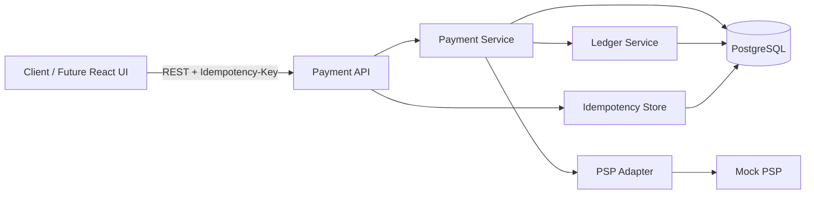
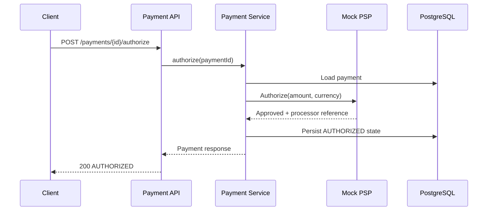
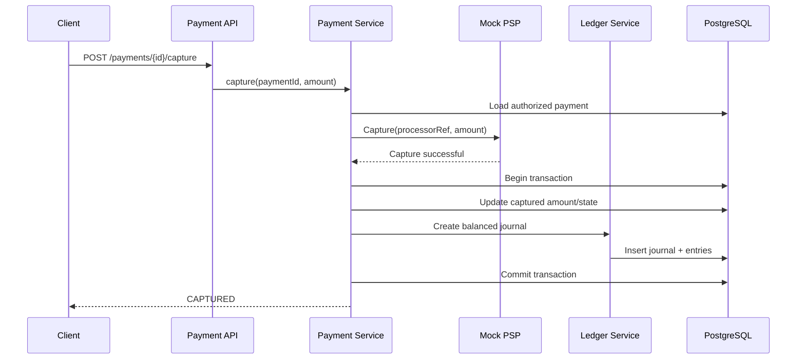

# 01 - System Overview

## Goal

Build the smallest useful vertical slice of a payment platform that demonstrates architecture-level payment concepts rather than just SDK integration.

## Initial Flow

## Authorization Flow

## Capture Flow

## Key Architectural Boundaries

- **Payment API** owns HTTP concerns and validation.
- **Payment Service** owns payment business rules and state transitions.
- **PSP Adapter** hides processor-specific APIs.
- **Ledger Service** owns accounting journal creation and balancing rules.
- **Idempotency Store** guarantees safe retry behavior for write requests.
- **PostgreSQL** is the initial source of truth for internal payment state and ledger data.

## First-Slice Invariants

1. Never use floating-point values for money.
2. Currency is explicit on every payment.
3. Capture amount cannot exceed remaining authorized amount.
4. Invalid state transitions are rejected.
5. A successful capture and its ledger journal must commit atomically.
6. Ledger journals are immutable after creation.
7. Every journal must balance: total debits = total credits.
8. Retrying the same operation with the same idempotency key returns the original logical result.
