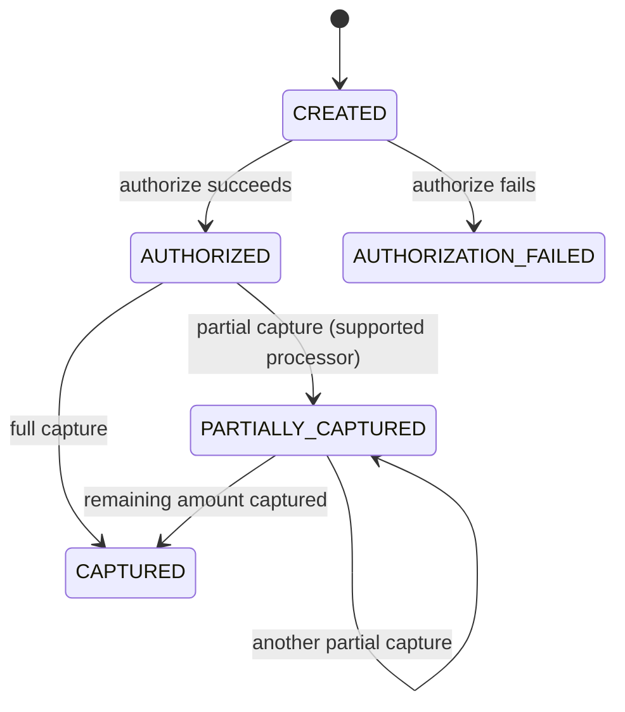

# 04 - Payment State Machine

## States in Slice 1

- `CREATED`
- `AUTHORIZED`
- `PARTIALLY_CAPTURED`
- `CAPTURED`
- `AUTHORIZATION_FAILED`

The POS endpoint returns only after the payment reaches its final capture result. The intermediate `AUTHORIZED` state remains available through the explicit authorization and capture endpoints.

## Diagram



## Allowed Transitions

| Current | Operation | Next |
|---|---|---|
| CREATED | authorize success | AUTHORIZED |
| CREATED | authorize failure | AUTHORIZATION_FAILED |
| AUTHORIZED | partial capture | PARTIALLY_CAPTURED |
| AUTHORIZED | full capture | CAPTURED |
| PARTIALLY_CAPTURED | partial capture | PARTIALLY_CAPTURED |
| PARTIALLY_CAPTURED | capture remaining amount | CAPTURED |

All other transitions are rejected unless later documented.

## Monetary State

Do not rely only on the status field. Keep explicit amounts:

```text
authorized_amount
captured_amount
```

Example:

```text
Payment amount      = 10000
Authorized amount   = 10000
Captured amount     = 4000
Status              = PARTIALLY_CAPTURED
Remaining capturable= 6000
```

## Business Rules

- Authorization in slice 1 authorizes the full requested amount.
- `captured_amount` is cumulative.
- Capture cannot exceed `authorized_amount - captured_amount`.
- Partial capture is supported only by processors that advertise that capability. The current Stripe and Adyen adapters require the full remaining authorized amount.
- Once fully captured, further capture requests fail unless they are exact idempotent retries of a prior request.
