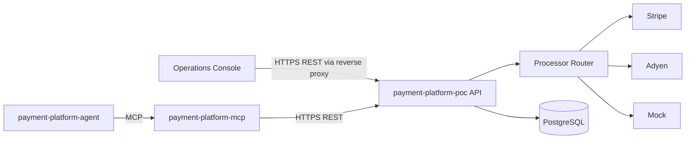

# 08 - AI and MCP Architecture

## Goal

Expose the payment platform to AI clients without coupling payment logic to an LLM or allowing AI code to access the database and processors directly.

## Repository Boundaries



### Payment platform repository

Owns payment state, idempotency, processor adapters, routing, ledger writes, and provider credentials. It has no dependency on MCP or an LLM.

### MCP repository

Owns the MCP protocol surface and an authenticated REST client for the payment API. It must not access PostgreSQL or call Stripe/Adyen directly.

### Agent repository

Owns the LLM runtime, planning, approval workflows, conversation state, and MCP client. It must use MCP tools instead of importing payment-platform code.

## Initial MCP Tools

The first MCP release exposes existing API capabilities:

| Tool | Operation | Risk |
|---|---|---|
| `get_payment` | Read one payment | Low |
| `pay_payment` | Create, authorize, capture, and record a payment | High |
| `refund_payment` | Refund part or all of a captured payment | High |

The MCP server returns structured JSON results and structured errors. Write requests carry an idempotency key generated by the MCP caller or supplied by the agent workflow.

## Safety Rules

- Never accept raw card numbers through an AI tool.
- Never bypass the payment API.
- Require explicit payment ID, amount, and currency for mutations.
- Require confirmation before adding refund, void, payout, or capture tools to an agent.
- Preserve payment API authorization, idempotency, audit, and correlation IDs.
- Treat provider and database state as authoritative over model output.
- Do not report a payment as successful unless the API returns the final state.

## Deployment

Each repository is independently versioned, built, tested, and deployed:

```text
payment-api.internal   <- payment-platform-poc
payment-mcp.internal   <- payment-platform-mcp
payment-agent.internal <- payment-platform-agent
```

The first MCP transport is stdio for local clients. A later deployment can add a network transport behind authentication without changing tool semantics.

The operations console is a browser-based demonstration client served from the Compose stack. It calls the payment API through an Nginx reverse proxy and displays authoritative payment state, processor routing results, captures, refunds, and ledger activity. It does not access PostgreSQL or provider APIs directly.

## Delivery Plan

1. Build and test `get_payment` and `pay_payment` in the MCP repository.
2. Add MCP authentication, timeouts, correlation IDs, and health/readiness checks.
3. Add read-only operational tools such as uncaptured-payment search.
4. Add proposal tools that validate mutations without executing them.
5. Build the separate agent using MCP tools and explicit approvals for high-risk actions.
6. Add webhook and reconciliation tools before automating asynchronous payment decisions.
